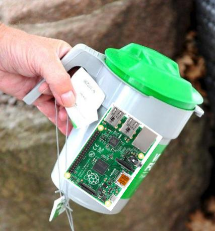

Automatisk Pengetelling
=======================
_Visste du at TV-aksjonen samlet inn 239 millioner i 2018?_

Kodesvingen er et nabolag litt utenom det vanlige. Hvert år arrangerer en liten gruppe entusiastiske frivillige den lokale innsamlingen til TV-aksjonen. De som bor i kodesvingen er spesielt glad i ny teknologi, og har stor tro på at man kan gjøre vanskelige ting enkelt med litt lur kode, derfor har bøsseansvarlig Monika i år koblet på en Raspberry Pi, betteri og en sensor på hver bøsse, sånn at de enklere kan telle opp hvor mye penger som er samlet inn.



Når man putter på penger, registrerer sensoren hvilken penge som er lagt på, og hvor mange av den pengen som er lagt på, og skriver den til en tekstfil.

```
1 tusenlapp,
3 tusenlapper,
1 femhundrelapp,
2 femhundrelapper,
1 tohundrelapp,
6 tohundrelapper,
1 hundrelapp,
8 hundrelapper,
1 femtilapp,
20 femtilapper,
1 tyvekroning,
3 tyvekroninger,
1 tikroning,
8 tikroninger,
1 femkroning,
90 femkroninger,
1 enkroning,
7 enkroninger,
```

Problemet til Monika er at hun trenger et program som kan summere opp hvor mange kroner det blir totalt. Kan du hjelpe henne med å lage en lite program som leser tekstfilen og finner ut hvor mange penger som er samlet inn totalt?

__TODO: Her skal du lage en funksjon som tar inn en streng med innholdet i filen, og returnerer et heltall med summen i kroner.__

Krav til løsning
----------------
- Programmet må kunne lese teksten med donasjoner og summere opp totalt antall donasjoner i hele kroner. I eksemplet over vil man f.eks. komme til at det er samlet inn X antall kroner.
- Du kan velge selv om du vil lese inn tekstfilen med donasjoner som en del av programmet, eller bare lime inn innholdet som en kommaseparert String.
- Når du er ferdig, bør programmet kunne regne ut hva som blir totalsummen i denne filen TODO.
- Vi har gjort klar litt kode i C#, Java (jdoodle.com/a/1CjV, https://github.com/cx-praktisk/donasjon-java) og Python som du kan velge å ta utgangspunkt i TODO.
- Når du er ferdig, melder du inn svaret ditt her, så kommer vi å sjekker at alt er i boks, og registrerer løsningen.

Konkurranse
-----------
Når du har laget en løsning som fungerer, er pengene til TV-aksjonen sikret. Da kan du konkurrere med de andre deltakerne om å lage en løsning med færrest mulig tegn i koden.