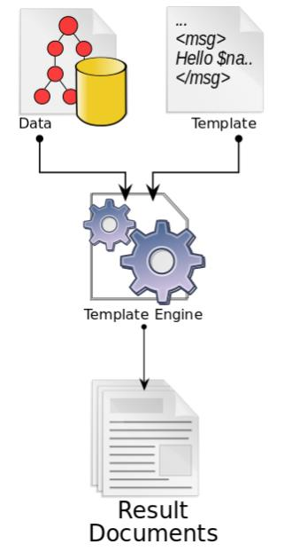

Smart Temafletting
==================
_Visste du at TV-aksjonen har blitt arrangert hvert år siden 1974?_

Jonas er ansvarlig for nettsidene til den lokale gruppen med frivillige som jobber med TV-aksjonen i Kodesvingen nabolag. For å unngå å måtte oppdatere nettsiden hvert år, har han satt opp nettsiden sånn at han kan flette inn en tekst med tema for TV-aksjonen basert på et årstall.



I tillegg har Jonas laget en csv-fil med årstall og hva som var tema for TV-aksjonen det året. Det Jonas mangler er et lite program som kan ta inn et årstall å gi tilbake temaet for det året, basert på innholdet i csv-filen.

```
1974,Flyktningerådet
1975,Norske Kvinners Sanitetsforening
1976,Norges Blindeforbund
1977,Kirkens Nødhjelp
1978,Redd Barna
1979,Flyktningerådet
1980,Landsforeningen mot kreft
1981,Norges Røde Kors + Norges Blindeforbund + Norges Handikapforbund og Norsk Forbund for Psykisk Utviklingshemmede
1982,Norsk Misjonsråd
1983,Norsk Folkehjelp
1984,Amnesty International
1985,Landsrådet for Norges barne- og ungdomsorganisasjoner
1986,Kirkens Nødhjelp
1987,Nasjonalforeningen for folkehelsen
1988,Flyktningerådet
1989,Kvinner i den tredje verden
1990,Redd Barna
1991,Atlas-Alliansen
1992,Rådet for psykisk helse + Psykisk helsevern
1993,Norges Røde Kors
1994,Norsk Folkehjelp
1995,Frelsesarmeen
1996,Miljø for livet
1997,Kreftforeningen
1998,Flyktningerådet
1999,Amnesty International
2000,SOS-barnebyer
2001,Kirkens Nødhjelp
2002,Atlas-Alliansen
2003,Redd Barna
2004,Kirkens Bymisjon og Rådet for psykisk helse
2005,FOKUS - Forum for Kvinner og Utviklingsspørsmål
2006,Leger Uten Grenser
2007,UNICEF + Norges idrettsforbund og olympiske og paralympiske komité og Right To Play
2008,Blå Kors Norge
2009,CARE Norge
2010,Flyktninghjelpen
2011,Norsk Folkehjelp
2012,Amnesty International Norge
2013,Nasjonalforeningen for folkehelsen
2014,Kirkens Nødhjelp
2015,Regnskogfondet
2016,Norges Røde Kors
2017,UNICEF-komiteen
2018,Kirkens Bymisjon
2019,CARE Norge
```

__TODO: Endre til ta inn en streng med innhold i csv-filen og returnere en streng med tema. +, & eller og?__

Krav til løsning
----------------
- Programmet må kunne ta inn et årstall fra 1974 til 2019 som et heltall, og svare med temaet som er vist i CSV-filen. - F.eks. skal 2008 gi Blå Kors Norge og 1992 gi "Rådet for psykisk helse,Psykisk helsevern".
- Du kan selv velge hvilket programmeringsspråk du bil bruke, og om du vil lese inn temaene fra CSV-filen, eller skrive de inn som en del av koden.
- En godkjent løsning må bestå av mindre enn 100 tegn TODO.

Konkurranse
-----------
Når du har laget en løsning som fungerer, er pengene til TV-aksjonen sikret. Da kan du konkurrere med de andre deltakerne om å lage en løsning med færrest mulig tegn i koden.


